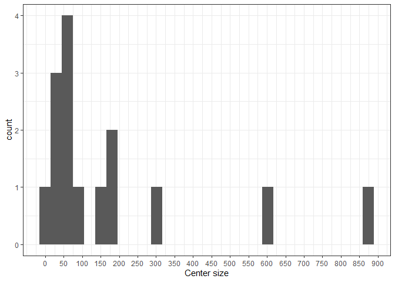

# Required packages

``` r
library(survival)
library(coxme)
library(frailtyEM)
library(tidyverse)
```

# EORTC data

``` r
# These data unfortunately not available for readers
dat <- read.csv("EORTC_10854.csv", stringsAsFactors = FALSE)

dat$periop <- 
  factor(dat$periop, 
         levels=c("no periop chemo","periop chemo"))
dat$surgery <- 
  factor(dat$surgery, 
         levels=c("mastectomy with RT","mastectomy without RT","breast conserving"))
dat$tusi <- 
  factor(dat$tusi, 
         levels=c("<2 cm","2-5 cm",">5 cm"))
dat$nodal <- 
  factor(dat$nodal, 
         levels=c("node negative","node positive"))
dat$age50 <- 
  factor(dat$age50, 
         levels=c("<=50",">50"))
dat$adjchem <- 
  factor(dat$adjchem, 
         levels=c("no adj chemo","adj chemo"))
dat$tam <- 
  factor(dat$tam, 
         levels=c("no tam","tam"))

dat$hospno <- factor(dat$hospno)
```

## Figure 9: histogram of center sizes

``` r
dat %>% 
  group_by(hospno) %>% 
  summarize(npat = n()) %>% 
  ggplot(aes(x = npat)) + geom_histogram() + 
  labs(x = "Center size") +
  # scale_x_continuous(breaks = c(0, 50, 100, 182, 304, 602, 880)) +
  scale_x_continuous(breaks = seq(0, 900, by=50)) +
  theme_bw()
```



## Figure 10: Kaplan-Meier survival estimates, overall and by center

``` r
# data set with Kaplan-Meier curves per center
sf <- survfit(Surv(survyrs, survstat) ~ strata(hospno), dat)
dd <- data.frame(time = sf$time, surv = sf$surv, center = as.factor(rep(1:length(sf$strata), sf$strata))) 
startpoint <- data.frame(center = unique(dd$center), time = 0, surv = 1)
dd <- rbind(dd, startpoint)

# data set with overall Kaplan-Meier curve
sf2 <- survfit(Surv(survyrs, survstat) ~ 1, dat)
dd2 <- data.frame(time = sf2$time, surv = sf2$surv) 

dd %>% 
  ggplot(aes(x = time, y = surv)) + 
  geom_step(aes(group = center),  show.legend = FALSE, alpha = 0.2) + 
  geom_step(data = dd2) + 
  theme_classic() + 
  labs(x = "Years since randomisation", y = "Survival")
```


## Table 1: Estimates from the Cox model, the fixed effects model, the gamma and log-normal frailty models. Estimated center effects of the fixed effects model have been omitted from the table.

``` r
m_cph <- coxph(Surv(survyrs, survstat) ~ surgery + tusi + nodal + age50 + adjchem +
        tam + periop + cluster(hospno), dat, ties = "breslow")
m_cph
```

    ## Call:
    ## coxph(formula = Surv(survyrs, survstat) ~ surgery + tusi + nodal + 
    ##     age50 + adjchem + tam + periop, data = dat, ties = "breslow", 
    ##     cluster = hospno)
    ## 
    ##                                  coef exp(coef) se(coef) robust se      z
    ## surgerymastectomy without RT  0.24848   1.28207  0.10993   0.16938  1.467
    ## surgerybreast conserving     -0.07443   0.92827  0.09668   0.10069 -0.739
    ## tusi2-5 cm                    0.34868   1.41720  0.09596   0.10426  3.344
    ## tusi>5 cm                     0.89086   2.43723  0.15284   0.15928  5.593
    ## nodalnode positive            0.96779   2.63211  0.10953   0.26169  3.698
    ## age50>50                      0.01392   1.01402  0.10303   0.11501  0.121
    ## adjchemadj chemo             -0.37713   0.68582  0.12627   0.35169 -1.072
    ## tamtam                       -0.17466   0.83974  0.11516   0.31423 -0.556
    ## periopperiop chemo           -0.12159   0.88551  0.07430   0.05745 -2.116
    ##                                     p
    ## surgerymastectomy without RT 0.142389
    ## surgerybreast conserving     0.459771
    ## tusi2-5 cm                   0.000825
    ## tusi>5 cm                    2.23e-08
    ## nodalnode positive           0.000217
    ## age50>50                     0.903656
    ## adjchemadj chemo             0.283571
    ## tamtam                       0.578324
    ## periopperiop chemo           0.034319
    ## 
    ## Likelihood ratio test=191.2  on 9 df, p=< 2.2e-16
    ## n= 2687, number of events= 729

``` r
m_fixed <- coxph(Surv(survyrs, survstat) ~ surgery + tusi + nodal + age50 +
                 adjchem + tam + periop + hospno, dat, ties = "breslow")

m_fixed
```

    ## Call:
    ## coxph(formula = Surv(survyrs, survstat) ~ surgery + tusi + nodal + 
    ##     age50 + adjchem + tam + periop + hospno, data = dat, ties = "breslow")
    ## 
    ##                                  coef exp(coef) se(coef)      z        p
    ## surgerymastectomy without RT  0.15726   1.17031  0.12958  1.214 0.224892
    ## surgerybreast conserving     -0.08924   0.91462  0.09924 -0.899 0.368510
    ## tusi2-5 cm                    0.35083   1.42024  0.09741  3.601 0.000317
    ## tusi>5 cm                     0.83196   2.29781  0.15618  5.327 9.99e-08
    ## nodalnode positive            0.76587   2.15087  0.11367  6.737 1.61e-11
    ## age50>50                      0.10128   1.10659  0.10441  0.970 0.332027
    ## adjchemadj chemo             -0.15391   0.85735  0.13924 -1.105 0.269028
    ## tamtam                        0.11651   1.12357  0.12501  0.932 0.351311
    ## periopperiop chemo           -0.12666   0.88103  0.07440 -1.703 0.088659
    ## hospnoB                       0.13790   1.14786  0.46814  0.295 0.768328
    ## hospnoC                       0.14499   1.15602  0.57141  0.254 0.799702
    ## hospnoD                       0.19955   1.22086  0.40046  0.498 0.618265
    ## hospnoE                       0.25632   1.29216  0.37166  0.690 0.490418
    ## hospnoF                       0.36292   1.43753  0.37945  0.956 0.338852
    ## hospnoG                       0.41660   1.51680  0.48111  0.866 0.386536
    ## hospnoH                       0.46849   1.59758  1.06851  0.438 0.661059
    ## hospnoI                       0.48900   1.63069  0.41642  1.174 0.240279
    ## hospnoJ                       0.56988   1.76805  0.37246  1.530 0.126007
    ## hospnoK                       0.69543   2.00456  0.43578  1.596 0.110531
    ## hospnoL                       0.72619   2.06719  0.58050  1.251 0.210946
    ## hospnoM                       1.13943   3.12498  0.41788  2.727 0.006397
    ## hospnoN                       1.17897   3.25103  0.37733  3.124 0.001781
    ## hospnoO                       1.22813   3.41483  0.37722  3.256 0.001131
    ## 
    ## Likelihood ratio test=271.8  on 23 df, p=< 2.2e-16
    ## n= 2687, number of events= 729

``` r
m_fr_cov <- coxph(Surv(survyrs, survstat) ~ frailty(hospno) + surgery + tusi + nodal + age50 +
                    adjchem + tam + periop, data = dat, ties = "breslow")
m_fr_cov
```

    ## Call:
    ## coxph(formula = Surv(survyrs, survstat) ~ frailty(hospno) + surgery + 
    ##     tusi + nodal + age50 + adjchem + tam + periop, data = dat, 
    ##     ties = "breslow")
    ## 
    ##                              coef se(coef)     se2   Chisq   DF       p
    ## frailty(hospno)                                    71.7513 11.2 6.7e-11
    ## surgerymastectomy without  0.1555   0.1259  0.1218  1.5255  1.0 0.21680
    ## surgerybreast conserving  -0.0806   0.0993  0.0991  0.6587  1.0 0.41703
    ## tusi2-5 cm                 0.3498   0.0973  0.0972 12.9132  1.0 0.00033
    ## tusi>5 cm                  0.8395   0.1562  0.1558 28.9033  1.0 7.6e-08
    ## nodalnode positive         0.7792   0.1135  0.1121 47.1628  1.0 6.5e-12
    ## age50>50                   0.0929   0.1038  0.1033  0.8008  1.0 0.37085
    ## adjchemadj chemo          -0.1665   0.1371  0.1339  1.4748  1.0 0.22459
    ## tamtam                     0.0930   0.1241  0.1217  0.5609  1.0 0.45391
    ## periopperiop chemo        -0.1258   0.0744  0.0744  2.8617  1.0 0.09071
    ## 
    ## Iterations: 10 outer, 37 Newton-Raphson
    ##      Variance of random effect= 0.196   I-likelihood = -5451.4 
    ## Degrees of freedom for terms= 11.2  1.9  2.0  1.0  1.0  1.0  1.0  1.0 
    ## Likelihood ratio test=270  on 20 df, p=<2e-16
    ## n= 2687, number of events= 729

``` r
m_emfrail <- emfrail(Surv(survyrs, survstat) ~ cluster(hospno) + surgery + tusi + nodal + age50 +
                       adjchem + tam + periop,
                     data = dat)
summary(m_emfrail)
```

    ## Call: 
    ## emfrail(formula = Surv(survyrs, survstat) ~ cluster(hospno) + 
    ##     surgery + tusi + nodal + age50 + adjchem + tam + periop, 
    ##     data = dat)
    ## 
    ## Regression coefficients:
    ##                                 coef exp(coef) se(coef) adj. se       z    p
    ## surgerymastectomy without RT  0.1580    1.1712   0.1242  0.1243  1.2716 0.20
    ## surgerybreast conserving     -0.0766    0.9262   0.0988  0.0989 -0.7747 0.44
    ## tusi2-5 cm                    0.3497    1.4186   0.0971  0.0971  3.6009 0.00
    ## tusi>5 cm                     0.8429    2.3231   0.1556  0.1556  5.4155 0.00
    ## nodalnode positive            0.7867    2.1961   0.1121  0.1124  6.9967 0.00
    ## age50>50                      0.0887    1.0928   0.1034  0.1036  0.8569 0.39
    ## adjchemadj chemo             -0.1742    0.8401   0.1339  0.1343 -1.2969 0.19
    ## tamtam                        0.0806    1.0839   0.1213  0.1223  0.6588 0.51
    ## periopperiop chemo           -0.1255    0.8821   0.0744  0.0744 -1.6871 0.09
    ## Estimated distribution: gamma / left truncation: FALSE 
    ## 
    ## Fit summary:
    ## Commenges-Andersen test for heterogeneity: p-val  5.65e-06 
    ## no-frailty Log-likelihood: -5473.196 
    ## Log-likelihood: -5450.928 
    ## LRT: 1/2 * pchisq(44.5), p-val 1.25e-11
    ## 
    ## Frailty summary:
    ##                    estimate lower 95% upper 95%
    ## Var[Z]                0.122     0.048     0.324
    ## Kendall's tau         0.058     0.023     0.139
    ## Median concordance    0.056     0.022     0.136
    ## E[logZ]              -0.062    -0.170    -0.024
    ## Var[logZ]             0.130     0.049     0.382
    ## theta                 8.170     3.089    20.987
    ## Confidence intervals based on the likelihood function

``` r
# -5450.928 likelihood

m_fr_cov_lnorm <- coxme(Surv(survyrs, survstat) ~ (1|hospno) + surgery + tusi + nodal + age50 +
                          adjchem + tam + periop, data = dat, ties = "breslow")

m_fr_cov_lnorm
```

    ## Cox mixed-effects model fit by maximum likelihood
    ##   Data: dat
    ##   events, n = 729, 2687
    ##   Iterations= 16 100 
    ##                     NULL Integrated    Fitted
    ## Log-likelihood -5568.792  -5449.455 -5434.199
    ## 
    ##                    Chisq    df p    AIC    BIC
    ## Integrated loglik 238.67 10.00 0 218.67 172.76
    ##  Penalized loglik 269.19 18.46 0 232.26 147.50
    ## 
    ## Model:  Surv(survyrs, survstat) ~ (1 | hospno) + surgery + tusi + nodal +      age50 + adjchem + tam + periop 
    ## Fixed coefficients
    ##                                     coef exp(coef)   se(coef)     z       p
    ## surgerymastectomy without RT  0.16072278 1.1743594 0.12402325  1.30 2.0e-01
    ## surgerybreast conserving     -0.07836890 0.9246233 0.09880962 -0.79 4.3e-01
    ## tusi2-5 cm                    0.34807585 1.4163397 0.09714009  3.58 3.4e-04
    ## tusi>5 cm                     0.83987823 2.3160849 0.15568882  5.39 6.9e-08
    ## nodalnode positive            0.78154007 2.1848345 0.11216982  6.97 3.2e-12
    ## age50>50                      0.08934354 1.0934562 0.10350399  0.86 3.9e-01
    ## adjchemadj chemo             -0.16676784 0.8463961 0.13502263 -1.24 2.2e-01
    ## tamtam                        0.09019117 1.0943835 0.12184300  0.74 4.6e-01
    ## periopperiop chemo           -0.12577961 0.8818092 0.07436749 -1.69 9.1e-02
    ## 
    ## Random effects
    ##  Group  Variable  Std Dev   Variance 
    ##  hospno Intercept 0.3633763 0.1320423

``` r
# -5449.445 
```

## Figure 11: Center effects from the fixed effects and frailty models, expressed in hazard ratios

``` r
# Obtain frailty estimates
sm <- summary(m_emfrail)
frailties <- sm$frail

# Obtain center estimates and calculate standard error
centers <- grep("hospno", names(m_fixed$coefficients))
nc <- length(centers)
var_centers <- m_fixed$var[centers, centers]

varmean <- sum(var_centers)/ nc^2

newse <- sqrt(c(varmean, diag(var_centers) + varmean - 2/nc * apply(var_centers, 1, sum)))

# Arrange frailty estimates and fixed effects estimates
logz <- frailties %>% 
  mutate_if(is.numeric, log) %>% 
  rename(estimate = z, ymin = lower_q, ymax = upper_q) %>% 
  mutate(type = "frailty")
  
fe <- data.frame(beta = c(hospnoA = 0, m_fixed$coefficients[centers]), sd = newse) %>% 
  rownames_to_column("Center") %>% 
  mutate(Center = substr(Center, 7, 9)) %>% 
  mutate(sbeta = sum(beta) / 15) %>% 
  mutate(beta = beta - sbeta) %>% 
  arrange(beta) %>%
  mutate(ord = 1:n()) %>% 
  mutate(Center = as.character(Center)) %>% 
  mutate(ymin = beta - 1.96 * sd, ymax = beta + 1.96 * sd) %>% 
  rename(id = Center, estimate = beta) %>% 
  select(-sd, -sbeta, -ord) %>% 
  mutate(type = "fixed effects") %>% 
  mutate(ord = 1:n()) 

ord_fe <- data.frame(id = fe$id, ord = fe$ord)
logz <- logz %>% 
  right_join(ord_fe)

datt <- bind_rows(logz, fe) 

# Finally, the plot
datt %>% 
 mutate_at(vars(estimate, ymin, ymax), .funs = exp) %>% # make it exp()
  ggplot(aes(x = ord, y = estimate)) + 
  geom_point(aes(colour = type), 
             position = position_dodge(.9)) + 
  geom_errorbar(aes(ymin = ymin, ymax = ymax, colour = type, linetype = type),
                position = position_dodge()) + 
  scale_x_continuous(labels = as.character(datt$id)[1:15], 
                     breaks = seq_along(datt$estimate)[1:15]) + 
  scale_y_continuous(trans = "log", 
                     breaks = seq(from = 0.5, to = 2.5, by = .5)) + 
  labs(x = "Center", 
       y="Center effect (hazard ratio)") + 
  theme_bw() + 
  theme(panel.grid.minor = element_blank()) +  
  guides(colour = guide_legend(title = element_blank()), linetype = guide_legend(title = element_blank())) + 
  scale_colour_brewer(palette = "Set1")
```


## Extra: Checking proportional hazards

``` r
# checking proportional hazards assumption

# in Cox model
cox.zph(m_cph)
```

    ##            chisq df       p
    ## surgery  5.12495  2 0.07711
    ## tusi    11.46821  2 0.00323
    ## nodal   13.60144  1 0.00023
    ## age50    0.00894  1 0.92468
    ## adjchem  0.00274  1 0.95824
    ## tam      0.64544  1 0.42175
    ## periop   0.01865  1 0.89138
    ## GLOBAL  28.93281  9 0.00067

``` r
# in Cox model with log-frailties as offset
logz_long <- log(m_emfrail$frail)[dat$hospno]

m_cph_offset_gamma <- coxph(Surv(survyrs, survstat) ~ surgery + tusi + nodal + age50 + adjchem +
                 tam + periop + offset(logz_long), dat, ties = "breslow")
cox.zph(m_cph_offset_gamma)
```

    ##            chisq df       p
    ## surgery  5.03863  2 0.08051
    ## tusi    11.67436  2 0.00292
    ## nodal   12.91629  1 0.00033
    ## age50    0.01513  1 0.90211
    ## adjchem  0.00564  1 0.94016
    ## tam      0.85231  1 0.35590
    ## periop   0.02159  1 0.88317
    ## GLOBAL  26.20116  9 0.00189

# CGD data

## Load data

``` r
data(cgd)
# head(cgd)

# rebrand id
cgd <- cgd %>% 
  mutate(id = as.numeric(as.factor(id))) 
```

## Figure 12: Event history of the CGD data. The length of the line indicates the length of follow-up, and the dots indicate the infections

``` r
cgd %>% 
  ggplot() +
  geom_segment(aes(x = tstart, xend = tstop, y = id, yend = id)) + 
  geom_point(data = filter(cgd, status == 1), aes(x = tstop, y = id)) + 
  theme_bw() + 
  labs(x = "time", y = "patient")
```


## Figure 13: Histogram of number of events per individual

``` r
cgd %>% 
  group_by(id) %>% 
  summarize(n_events = sum(status)) %>% 
  ggplot(aes(x = n_events)) + 
  geom_bar() + 
  labs(x= "Number of events / individual") + 
  theme_bw()
```


## Extra: Grid search for optimal m for Compound Poisson

``` r
mvals <- seq(from = 0.1, to = 2, by = 0.2)
models <- lapply(mvals, function(x) emfrail(formula = Surv(tstart, tstop, status) ~ sex +
    treat + age + propylac + inherit + steroids + cluster(id), data = cgd, 
    distribution = emfrail_dist(dist = "pvf", pvfm = x)) )

likelihoods <- sapply(models, function(x) x$loglik[2])

mvals[which.max(likelihoods)]
```

    ## [1] 1.1

## Table 2: Estimates of the regression coefficients and fit summary from the Cox model and shared frailty models, with gamma, inverse Gaussian, positive stable and compound Poisson (with parameters 0.5 and 1.1) distributions, fitted on the CGD data

``` r
m_cph <- coxph(Surv(tstart, tstop, status) ~ treat + age +inherit + steroids, cgd)
# summary(m_cph)


m_gamma_emf <- emfrail(Surv(tstart, tstop, status) ~ treat + sex + age +inherit + steroids + cluster(id), cgd)
# summary(m_gamma_emf)

mod_ig <- emfrail(formula = Surv(tstart, tstop, status) ~  treat + sex +
                    age + inherit + steroids + cluster(id), 
                  distribution = emfrail_dist(dist = "pvf"),
                  data = cgd)

mod_cp <- emfrail(formula = Surv(tstart, tstop, status) ~  treat + sex +
                    age + inherit + steroids + cluster(id), 
                  distribution = emfrail_dist(dist = "pvf", pvfm = 0.5),
                  data = cgd)

mod_cp_11 <- emfrail(formula = Surv(tstart, tstop, status) ~  treat + sex +
                    age + inherit + steroids + cluster(id), 
                  distribution = emfrail_dist(dist = "pvf", pvfm = 1.1),
                  data = cgd)

mod_stab <- emfrail(formula = Surv(tstart, tstop, status) ~ treat + sex + 
                      age + inherit + steroids + cluster(id), 
                    distribution = emfrail_dist(dist = "stable"),
                    data = cgd)
```

## Figure 14: Histogram of estimated frailties

``` r
autoplot(m_gamma_emf, type = "hist") + 
  theme_bw()
```


# R session Info

``` r
sessionInfo()
```

    ## R version 4.0.3 (2020-10-10)
    ## Platform: x86_64-w64-mingw32/x64 (64-bit)
    ## Running under: Windows 10 x64 (build 17134)
    ## 
    ## Matrix products: default
    ## 
    ## locale:
    ## [1] LC_COLLATE=Dutch_Netherlands.1252  LC_CTYPE=Dutch_Netherlands.1252   
    ## [3] LC_MONETARY=Dutch_Netherlands.1252 LC_NUMERIC=C                      
    ## [5] LC_TIME=Dutch_Netherlands.1252    
    ## 
    ## attached base packages:
    ## [1] stats     graphics  grDevices utils     datasets  methods   base     
    ## 
    ## other attached packages:
    ##  [1] forcats_0.5.0   stringr_1.4.0   dplyr_1.0.0     purrr_0.3.4    
    ##  [5] readr_1.3.1     tidyr_1.1.0     tibble_3.0.1    ggplot2_3.3.1  
    ##  [9] tidyverse_1.3.0 frailtyEM_1.0.1 coxme_2.2-16    bdsmatrix_1.3-4
    ## [13] survival_3.1-12
    ## 
    ## loaded via a namespace (and not attached):
    ##  [1] Rcpp_1.0.6          mvtnorm_1.1-1       msm_1.6.8          
    ##  [4] lubridate_1.7.9     lattice_0.20-41     assertthat_0.2.1   
    ##  [7] digest_0.6.25       R6_2.4.1            cellranger_1.1.0   
    ## [10] backports_1.1.7     reprex_0.3.0        evaluate_0.14      
    ## [13] highr_0.8           httr_1.4.2          pillar_1.4.4       
    ## [16] rlang_0.4.6         readxl_1.3.1        rstudioapi_0.11    
    ## [19] blob_1.2.1          Matrix_1.2-18       rmarkdown_2.6      
    ## [22] labeling_0.3        splines_4.0.3       munsell_0.5.0      
    ## [25] broom_0.5.6         compiler_4.0.3      numDeriv_2016.8-1.1
    ## [28] modelr_0.1.8        xfun_0.20           pkgconfig_2.0.3    
    ## [31] htmltools_0.4.0     tidyselect_1.1.0    expm_0.999-4       
    ## [34] fansi_0.4.1         crayon_1.3.4        dbplyr_1.4.4       
    ## [37] withr_2.2.0         grid_4.0.3          nlme_3.1-148       
    ## [40] jsonlite_1.7.0      gtable_0.3.0        lifecycle_0.2.0    
    ## [43] DBI_1.1.0           magrittr_1.5        scales_1.1.1       
    ## [46] cli_2.0.2           stringi_1.4.6       farver_2.0.3       
    ## [49] fs_1.4.1            xml2_1.3.2          ellipsis_0.3.1     
    ## [52] generics_0.0.2      vctrs_0.3.1         expint_0.1-6       
    ## [55] RColorBrewer_1.1-2  tools_4.0.3         glue_1.4.1         
    ## [58] hms_0.5.3           yaml_2.2.1          colorspace_1.4-1   
    ## [61] rvest_0.3.6         knitr_1.31          haven_2.3.1
